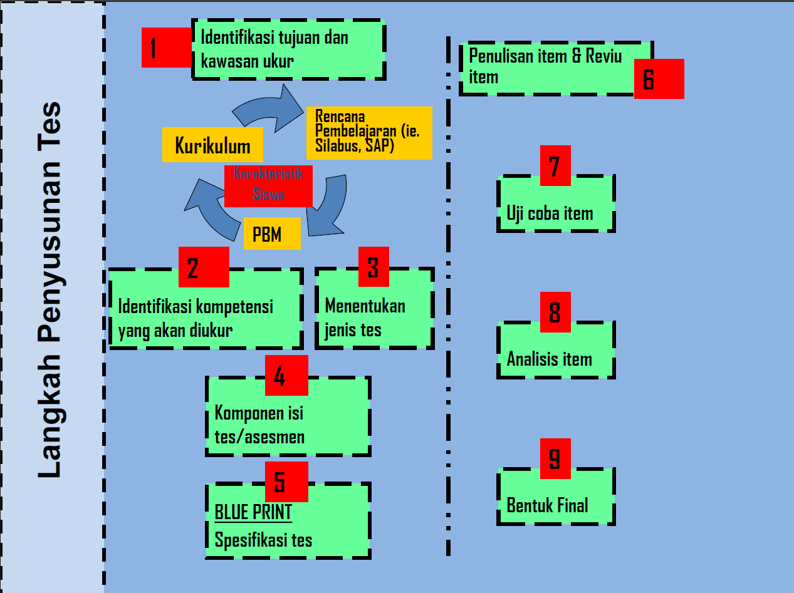

## _Outline_

::: {.incremental}
* Urutan pengerjaan: menulis item lebih dulu atau menyusun rencana lebih dulu?
* 11 tahap, 4 fase penyusunan
* Fase Perencanaan: definisi konstrak dan blueprint
* Fase Pengembangan Item
* Fase Uji Empiris
* Fase Finalisasi
* Sifat iteratif proses
* Aktivitas: menilai proses penyusunan tes
:::

::: aside
***Disclosure* penggunaan akal imitasi (AI)**

Saya menggunakan Claude Code (Model Opus 5 dan Sonnet 5) untuk *brainstorming* materi, mencari referensi, dan melakukan *troubleshooting* kode `quarto` dan `git`. Saya bertanggung jawab penuh atas substansi dan penyajian presentasi ini.
:::

# Urutan pengerjaan menulis item {background-color="#14497F" .center}

## Kelompok Anda baru saja mendapat tugas

Menyusun tes bakat numerik untuk calon peserta pelatihan kerja. Apa yang harus dilakukan **pertama kali**?

. . .

::: {.incremental}
* Sebagian besar akan mulai dengan menulis soal hitungan, tanpa menyusun definisi konstruk atau *blueprint* terlebih dahulu.
* Dalam satu jam, biasanya sudah terkumpul sekitar 20 butir soal.
* Masalahnya baru terlihat saat butir-butir itu diuji cobakan: domain yang diwakili tidak jelas, proporsinya tidak seimbang, dan validitas isinya sulit dipertanggungjawabkan.
:::

. . .

::: {.callout-warning}
#### Konsekuensi dari urutan ini
Menulis item sering dianggap sebagai aktivitas yang terpenting, sedangkan definisi konstruk dan *blueprint* dianggap sebagai langkah administratif. Namun urutan ini menentukan apakah item yang ditulis memiliki dasar yang dapat dipertanggungjawabkan.
:::

# Tidak ada resep baku {background-color="#14497F" .center}

## Ada banyak versi, tetapi logikanya sama

::: {.incremental}
* [Kline (1986)](https://psycnet.apa.org/record/1987-97491-000) menyusun tahapannya sendiri. 
* Azwar (2019) punya urutan yang sedikit berbeda. 
* [Downing (2006)](https://fatihegitim.wordpress.com/wp-content/uploads/2014/03/hndb-t-devt.pdf), dalam *Handbook of Test Development*, merinci **dua belas langkah** untuk pengujian berskala besar.
* Detailnya berbeda-beda, tapi **logika besarnya sama**: rencanakan dulu apa dan bagaimana yang mau diukur, kembangkan itemnya, uji secara empiris, baru finalisasi.
:::

. . .

::: {.callout-note}
#### Yang kita pakai di mata kuliah ini
Kita memakai sintesis sebelas tahap yang dikelompokkan jadi empat fase besar. Ini **bukan** satu-satunya cara yang "benar" — tapi ini yang akan memandu proyek kelompok Anda dari Pertemuan 9 sampai 14.
:::

# 1️⃣1️⃣ tahap, 4️⃣ fase {background-color="#14497F" .center}

## Peta besarnya

| Fase | Tahap | Di MK ini |
|---|---|:-:|
| **A. Perencanaan** | 1–4 | Pertemuan 9–10 |
| **B. Pengembangan Item** | 5–6 | Pertemuan 11 |
| **C. Uji Empiris** | 7–9 | Pertemuan 12–13 |
| **D. Finalisasi** | 10–11 | Pertemuan 14 |

::: aside
Diadaptasi dan disintesis dari [Kline (1986)](https://psycnet.apa.org/record/1987-97491-000), Azwar (2019), dan [Downing (2006)](https://fatihegitim.wordpress.com/wp-content/uploads/2014/03/hndb-t-devt.pdf).
:::

# Fase A: Perencanaan {background-color="#14497F" .center}

## Tahap 1–2: tujuan dan konstruk

::: {.incremental}
1. **Identifikasi tujuan dan cakupan konstruk yang diukur** — untuk apa tes ini dipakai, dan pada populasi seperti apa?
2. **Definisi konstruk** — apa sebenarnya yang diukur, dirumuskan secara operasional berdasarkan teori.
:::

. . .

::: {.callout-important}
#### Tahap yang sering terlewat
Banyak orang cenderung melompati Tahap 2 karena dianggap "sudah jelas". Semua orang merasa tahu apa itu "kemampuan numerik". Tetapi tanpa definisi operasional yang eksplisit, tidak ada dasar untuk memutuskan item mana yang **termasuk** dan mana yang **tidak termasuk** ke dalam tes. Ini konsep operasionalisasi konstruk yang sudah Anda pelajari dari MK Psikometri.
:::

## Tahap 3–4: jenis tes dan *blueprint*

::: {.incremental}
3. **Menentukan jenis tes** — apakah ini tes prestasi, potensi, atau inteligensi? (Pertemuan 1 relevan lagi di sini.)
4. **Menyusun spesifikasi tes/*blueprint*** — proporsi item untuk tiap sub-domain, dan berapa jumlah itemnya.
:::

. . .

::: {.callout-tip}
#### Contoh sederhana blueprint
Tes bakat numerik dengan 3 sub-domain, 20 item:

| Sub-domain | Proporsi | Jumlah item |
|---|:-:|:-:|
| Operasi hitung dasar | 40% | 8 |
| Deret angka/pola | 30% | 6 |
| Soal cerita kuantitatif | 30% | 6 |

*Blueprint* juga biasanya menyilangkan domain isi dengan **level kognitif** yang ingin diukur, dan akan kita bahas lebih lengkap di Pertemuan 3 lewat taksonomi tujuan instruksional.
:::

# Fase B: Pengembangan Item {background-color="#14497F" .center}

## Tahap 5–6: menulis dan menelaah

::: {.incremental}
5. **Penulisan item** — sesuai proporsi dan level kognitif yang sudah ditetapkan di *blueprint*, bukan berdasarkan preferensi pribadi penulis item.
6. **Telaah/*review* ahli** — item diperiksa oleh pihak lain (idealnya yang paham konstruknya) sebelum diuji cobakan, sebagai bukti awal validitas isi.
:::

. . .

::: {.callout-warning}
#### Fungsi tahap telaah
Penulis item sering tidak menyadari masalah pada item yang ditulisnya sendiri, misalnya kalimat yang ambigu, kunci jawaban ganda, atau petunjuk yang bias secara budaya. Telaah oleh pihak lain menjadi pemeriksaan pertama sebelum item digunakan pada partisipan sesungguhnya.
:::

# Fase C: Uji Empiris {background-color="#14497F" .center}

## Tahap 7–9: dari data ke bukti

::: {.incremental}
7. **Uji coba (*try-out*)** — item diberikan pada sampel yang representatif terhadap populasi sasaran.
8. **Analisis butir** — memeriksa tingkat kesulitan dan daya beda tiap item dari data uji coba.
9. **Estimasi reliabilitas dan validitas** — dihitung dari hasil analisis butir dan item yang dipertahankan.
:::

. . .

::: {.callout-note}
#### Fungsi tahap ini
Tiga tahap ini adalah bagian proses di mana kualitas tes diuji berdasarkan data, bukan hanya penilaian ahli. Bagian ini dibahas lebih lanjut di Pertemuan 12–13.
:::

# Fase D: Finalisasi {background-color="#14497F" .center}

## Tahap 10–11: norma dan manual

::: {.incremental}
10. **Penyusunan norma** — mengubah skor mentah menjadi skor yang bisa dimaknai (desil, persentil, skor standar) relatif terhadap kelompok acuan.
11. **Penyusunan manual tes** — dokumentasi lengkap tentang cara mengadministrasikan, menyekor, dan menginterpretasikan tes.
:::

. . .

::: {.callout-tip}
#### Ini luaran Tugas 3 Anda
*Booklet* tes (berisi item yang lolos seleksi) dan manual tes yang Anda kumpulkan di Pertemuan 14 **adalah** Tahap 10 dan 11 ini.
:::

# Sifat iteratif proses pengembangan tes {background-color="#14497F" .center}

## Pengulangan antar tahap

::: {.incremental}
* Sebelas tahap ini digambarkan secara linear, tetapi dalam praktiknya sering perlu kembali ke tahap sebelumnya.
* Analisis butir menunjukkan item timpang di satu sub-domain → kembali ke **Tahap 5** untuk menulis item pengganti, kadang kembali ke **Tahap 4** untuk merevisi *blueprint*-nya.
* Reliabilitas ternyata terlalu rendah → bisa berarti kembali ke penulisan item, bukan sekadar menambah jumlah item.
:::

. . .

::: {.callout-important}
#### Konsekuensi untuk jadwal proyek Anda
Alokasikan waktu untuk kemungkinan kembali ke tahap sebelumnya. Kelompok yang mengerjakan tiap tahap hanya satu kali tanpa peninjauan ulang cenderung mengalami kendala waktu di Pertemuan 13–14.
:::

## Ringkasan Tahapan Penyusunan Tes

{fig-align="center" width="60%"}

::: aside
Diagram ini menyederhanakan sebelas tahap di atas menjadi sembilan kotak visual — misalnya Tahap 5 dan 6 digabung menjadi "Penulisan item & Reviu item", serta Tahap 10 dan 11 digabung menjadi "Bentuk Final". Pengelompokan visualnya berbeda, tetapi logika dan urutan besarnya tetap sama.
:::

## Ringkasan

::: {.incremental}
1. Menulis item tanpa definisi konstruk dan *blueprint* terlebih dahulu adalah kesalahan umum yang berisiko menghasilkan proporsi domain yang tidak sesuai rencana.
2. Ada banyak versi tahapan di literatur ([Kline, 1986](https://psycnet.apa.org/record/1987-97491-000); Azwar, 2019; [Downing, 2006)](https://fatihegitim.wordpress.com/wp-content/uploads/2014/03/hndb-t-devt.pdf)).
3. Sebelas tahap mata kuliah ini terbagi jadi empat fase: **Perencanaan, Pengembangan Item, Uji Empiris, Finalisasi**.
4. Prosesnya **iteratif**, alokasikan waktu untuk kembali ke tahap sebelumnya.
:::

## Untuk Pertemuan 3

::: {.callout-tip}
#### Selanjutnya: taksonomi dan tujuan instruksional
*Blueprint* yang kita singgung hari ini menyilangkan domain isi dengan **level kognitif**. Pertemuan 3 membahas taksonomi yang jadi dasar penentuan level kognitif tersebut — alat yang akan Anda pakai langsung saat menyusun *blueprint* proyek Anda.
:::

## Ada pertanyaan❓

{fig-align="center"}

::: {.callout-note}
### Catatan

* Paparan disusun dengan menggunakan  dan [**Quarto**](https://quarto.org) dengan *template* dari [UNAIR Theme](https://github.com/rameliaz/quarto-unair-theme).
* Kontak saya via <i class="fas fa-paper-plane"></i> <a href="mailto:amelia.zein@psikologi.unair.ac.id">amelia.zein@psikologi.unair.ac.id</a>
:::

## Rujukan

Azwar, S. (2019). *Konstruksi tes: Kemampuan kognitif*. Pustaka Pelajar.

Downing, S. M. (2006). Twelve steps for effective test development. In S. M. Downing & T. M. Haladyna (Eds.), *Handbook of test development*. Lawrence Erlbaum Associates.

Kline, P. (1986). *A handbook of test construction: Introduction to psychometric design*. Methuen.
