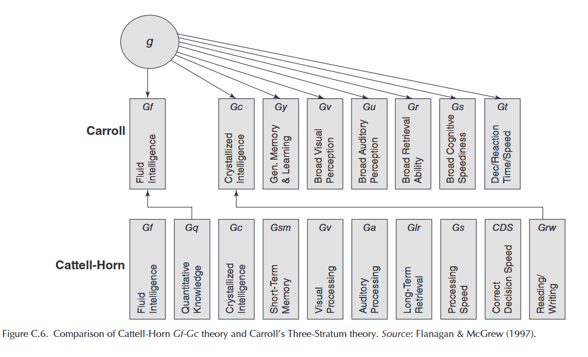
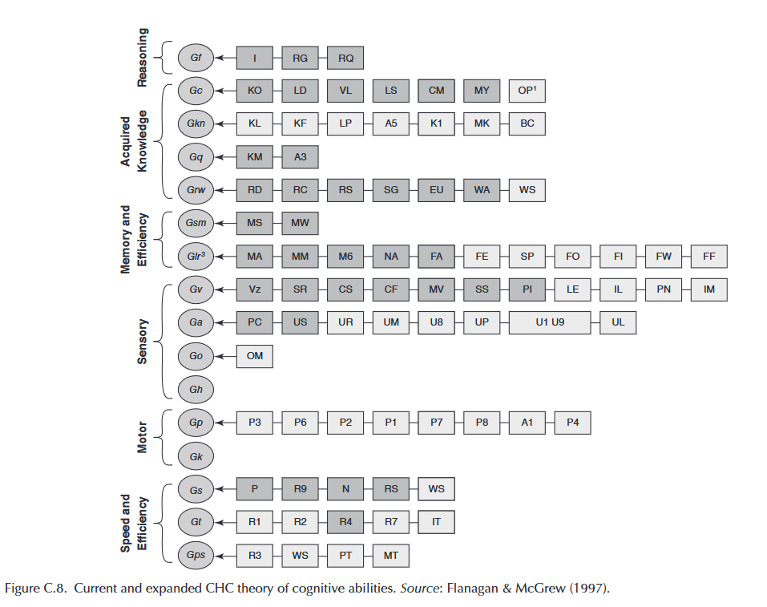
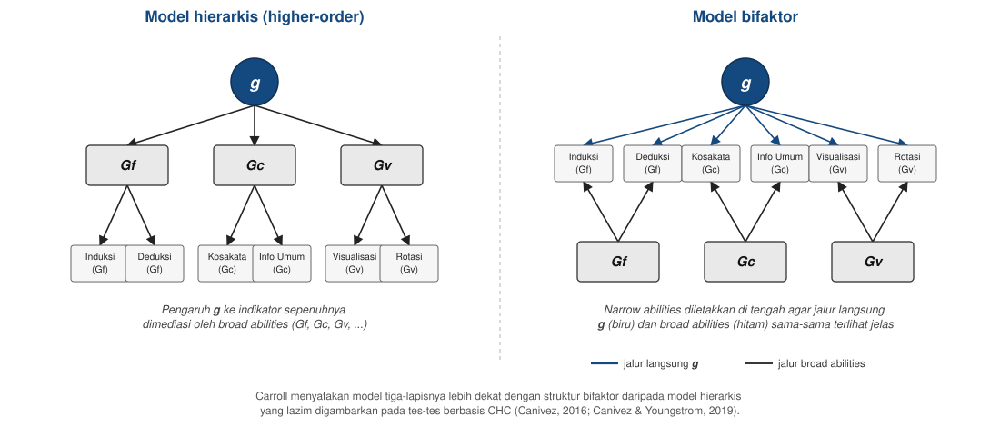

## _Outline_

::: {.incremental}
* Definisi tes inteligensi
* Sejarah singkat teori inteligensi
* Sejarah yang perlu diketahui
* Teori Cattell–Horn–Carroll (CHC)
* CHC di Indonesia
* Dua teori lain: *triarchic* dan *multiple intelligences*
* Jenis-jenis tes inteligensi
* Aktivitas: mengidentifikasi tes inteligensi dalam artikel ilmiah
:::

::: aside
***Disclosure* penggunaan akal imitasi (AI)**

Saya menggunakan Claude Code (Model Opus 5 dan Sonnet 5) untuk *brainstorming* materi, membuat grafik, mencari referensi, dan melakukan *troubleshooting* kode `quarto` dan `git`. Saya bertanggung jawab penuh atas substansi dan penyajian presentasi ini.
:::

# Definisi tes inteligensi {background-color="#14497F" .center}

## Definisi yang paling sering dikutip

> Intelligence is the aggregate or global capacity of the individual to act purposefully, to think rationally and to deal effectively with his environment.
>
> — Wechsler (1958, p. 7)

. . .

Terjemahan bebasnya: **inteligensi adalah kapasitas global seseorang untuk bertindak dengan tujuan, berpikir rasional, dan berinteraksi secara efektif dengan lingkungannya.**

::: {.callout-note}
#### Catatan
Definisi ini menekankan tiga aspek sekaligus: perilaku terarah, penalaran, dan kemampuan beradaptasi dengan lingkungan.
:::

# Sejarah singkat teori inteligensi {background-color="#14497F" .center}

## Dari satu faktor ke banyak faktor

::: {.incremental}
* **Spearman (1904)** menemukan bahwa skor pada berbagai tes kemampuan cenderung saling berkorelasi positif, dan menyimpulkan adanya satu faktor umum yang mendasarinya, yang kemudian disebut ***g*** (*general intelligence*).
* **Thurstone (1938)** menentang gagasan faktor tunggal ini. Melalui analisis faktor terhadap puluhan tes, ia mengusulkan tujuh kemampuan mental primer yang relatif independen, misalnya kemampuan verbal, numerik, dan spasial.
* **Cattell (1963)** memakai istilah ***fluid intelligence* (Gf)** untuk kapasitas bernalar pada situasi baru, dan ***crystallized intelligence* (Gc)** untuk pengetahuan yang sudah diperoleh melalui pembelajaran.
:::

## Menuju CHC

::: {.incremental}
* **[Carroll (1993)](https://books.google.de/books?hl=id&lr=&id=JQX-PlF6EgYC&oi=fnd&pg=PA1&dq=carroll+1993+intelligence+theory&ots=_sMO6xvIYP&sig=3vIwKRnZ1f070onJ9kvzQc4UFFY&redir_esc=y#v=onepage&q=carroll%201993%20intelligence%20theory&f=false)** menganalisis ulang lebih dari 460 kumpulan data kemampuan kognitif dan mengusulkan model tiga lapis (*three-stratum*): faktor umum (*g*) di puncak, sejumlah faktor luas di lapis kedua, dan puluhan faktor sempit di lapis ketiga.
* Model Cattell–Horn (Gf-Gc) dan model tiga lapis Carroll kemudian digabungkan menjadi **teori Cattell–Horn–Carroll (CHC)** sebagai kerangka teoretis yang dipakai secara luas pada tes inteligensi kontemporer.
:::

::: aside
[Wasserman (2018)](https://books.google.de/books?hl=id&lr=&id=5pxgDwAAQBAJ&oi=fnd&pg=PA3&dq=wasserman+2018+intelligence+assessment&ots=T_gM2ZlP8L&sig=_0z2oZYwLsXhixBGOt3wjLE3TVk&redir_esc=y#v=onepage&q=wasserman%202018%20intelligence%20assessment&f=false); Schneider & [McGrew (2023)](https://www.mdpi.com/2079-3200/11/2/32).
:::

# Sejarah yang perlu diketahui {background-color="#14497F" .center}

## Penyalahgunaan tes inteligensi di masa lalu

::: {.incremental}
* Pada awal abad ke-20, skor tes inteligensi pernah dipakai sebagai dasar kebijakan sterilisasi paksa terhadap orang dengan disabilitas intelektual di Amerika Serikat, termasuk kasus *Buck v. Bell* (1927) yang disahkan oleh Mahkamah Agung AS.
* Sejumlah tokoh awal dalam pengembangan tes inteligensi juga terlibat dalam gerakan eugenika, yang bertujuan "memperbaiki" populasi manusia berdasarkan atribut yang dianggap terwariskan.
:::

::: aside
[Wasserman (2018)](https://books.google.de/books?hl=id&lr=&id=5pxgDwAAQBAJ&oi=fnd&pg=PA3&dq=wasserman+2018+intelligence+assessment&ots=T_gM2ZlP8L&sig=_0z2oZYwLsXhixBGOt3wjLE3TVk&redir_esc=y#v=onepage&q=wasserman%202018%20intelligence%20assessment&f=false).
:::

::: {.callout-note}
#### Kaitan dengan Pertemuan 1
Sejarah ini adalah salah satu alasan mengapa penggunaan tes psikologi di Indonesia dibatasi oleh Kode Etik Psikologi Indonesia (HIMPSI, 2010) yang sudah dibahas di Pertemuan 1.
:::

# Teori Cattell–Horn–Carroll (CHC) {background-color="#14497F" .center}

## Struktur bertingkat

[CHC](https://en.wikipedia.org/wiki/Cattell%E2%80%93Horn%E2%80%93Carroll_theory) menyusun kemampuan kognitif dalam empat tingkat:

::: {.incremental}
1. **Kemampuan spesifik** — terikat pada satu tugas atau tes tertentu; satu-satunya level yang bisa diukur secara langsung. Perannya adalah sebagai indikator dari *narrow abilities*.
2. ***Narrow abilities*** — kumpulan kemampuan spesifik yang saling berkorelasi tinggi.
3. ***Broad abilities*** — kumpulan *narrow abilities* yang saling berkorelasi lebih tinggi satu sama lain dibanding dengan *broad abilities* lainnya, diberi kode diawali huruf G.
4. **Kemampuan umum (*g*)** — faktor tunggal di puncak struktur.
:::

::: aside
[Schneider & McGrew (2018)](https://www.guilford.com/books/Contemporary-Intellectual-Assessment/Flanagan-McDonough/9781462552030?srsltid=AfmBOoobR-bSqr32LuIFH_Uck3fErZQ_9L0DuU6_B31osW-6apDWOyyt).
:::

## Struktur CHC

{fig-align="center"}

## Beberapa *broad abilities* dalam CHC (1)

{fig-align="center"}

::: aside
Sumber: [Schneider & McGrew (2018)](https://onlinelibrary.wiley.com/doi/pdf/10.1002/9781118660584.ese0431?src=getftr).
:::

## CHC melandasi beberapa tes intelegensi (1)

| Tes | *Broad abilities* yang diukur | Catatan |
|---|---|---|
| Woodcock-Johnson IV (WJ IV; Schrank dkk., 2014) | 7 | Dirancang eksplisit sebagai operasionalisasi CHC; jadi acuan utama pengembangan taksonomi CHC itu sendiri |
| Wechsler (WISC-V, WAIS-IV; Wechsler, 2014) | 5 | *Index scores* diselaraskan dengan lima *broad abilities* CHC (Gf, Gc, Gv, Gwm, Gs) |
| Kaufman Assessment Battery for Children–II (KABC-II; Kaufman & Kaufman, 2004) | 5 | Menyediakan dua model interpretasi yang bisa dipilih penguji: CHC atau model Luria |

: {tbl-colwidths="[30,15,55]"}

::: aside
[Schneider & McGrew (2018)](https://www.guilford.com/books/Contemporary-Intellectual-Assessment/Flanagan-McDonough/9781462552030?srsltid=AfmBOoobR-bSqr32LuIFH_Uck3fErZQ_9L0DuU6_B31osW-6apDWOyyt).
:::

## CHC melandasi beberapa tes intelegensi (2)

| Tes | *Broad abilities* yang diukur | Catatan |
|---|---|---|
| Differential Ability Scales–II (DAS-II; Elliott, 2007) | 5 | Selaras dengan CHC sejak edisi kedua |
| Stanford-Binet–5 (SB5; Roid, 2003) | 5 | Lima faktornya dipetakan langsung ke lima *broad abilities* CHC |

: {tbl-colwidths="[30,15,55]"}

::: {.callout-note}
#### Catatan
Klaim keselarasan dengan CHC pada dua slide ini berasal dari manual/*technical report* masing-masing penerbit tes. Dua slide berikutnya menunjukkan bahwa klaim ini tidak selalu bertahan ketika diuji ulang secara independen.
:::

## Bukti empirik teori CHC 1️⃣: yang didukung

::: {.incremental}
* Struktur *broad abilities* CHC dibangun dari analisis faktor terhadap ratusan kumpulan data psikometrik, termasuk reanalisis [Carroll (1993)](https://books.google.de/books?hl=id&lr=&id=JQX-PlF6EgYC&oi=fnd&pg=PA1) atas lebih dari 460 dataset, dan pengelompokan ini banyak direplikasi lintas studi.
  + Inilah alasan mengapa CHC dianggap menawarkan landasan konseptual tentang kemampuan kognitif dengan bukti faktor-analitik paling kuat dibanding teori-teori inteligensi lain.
* Analisis [*network psychometrics*](https://psycnet.apa.org/record/2018-10249-031) terhadap tes Woodcock–Johnson ([McGrew dkk., 2023](https://www.mdpi.com/2079-3200/11/1/19)) juga mendukung keberadaan *broad abilities* utama CHC sebagai kelompok yang secara statistik dapat dibedakan.
* Di berbagai studi, faktor umum (*g*) tetap menjadi prediktor tunggal terkuat untuk prestasi akademik, jauh melebihi kontribusi skor *broad* atau *narrow abilities* manapun.
:::

::: aside
[Canivez & Youngstrom (2019)](https://www.tandfonline.com/doi/abs/10.1080/08957347.2019.1619562).
:::

## Bukti empirik teori CHC 2️⃣: yang belum mencapai konsensus

::: {.incremental}
* Status *g* sendiri masih diperdebatkan oleh tokoh-tokoh yang namanya dipakai dalam CHC. 
  + Horn menganggap *g* sebagai artefak statistik dan **tidak pernah memasukkannya** ke model Gf-Gc. 
  + Sementara Carroll memasukkannya, tetapi sebagai **model bifaktor**, bukan hierarki bertingkat rapi seperti yang lazim digambarkan di buku teks ([Canivez & Youngstrom, 2019](https://www.tandfonline.com/doi/abs/10.1080/08957347.2019.1619562)).
* Analisis independen (di luar penerbit tes) terhadap tes-tes utama yang mengklaim selaras dengan CHC (WJ III, WJ IV, WISC-V) berulang kali **gagal mereplikasi** jumlah dan pembagian *broad abilities* yang diklaim dalam manual tes. 
  + Ada kesenjangan antara model teoretis dan struktur skor yang benar-benar dihasilkan alat ukurnya ([McGill & Dombrowski, 2019](https://rjmcgill.com/wp-content/uploads/2019/06/chc.pdf)).

:::

## Bukti empirik teori CHC 2️⃣: yang belum mencapai konsensus

::: {.incremental}

* Bukti validitas prediktifnya timpang: sebuah meta-analisis atas hubungan CHC dengan prestasi akademik menemukan bahwa ***g* menjelaskan ~54% varians** prestasi akademik. Jauh lebih besar daripada *broad abilities* manapun. 
  + Sementara masing-masing *broad abilities* rata-rata hanya menjelaskan **di bawah 10%** (tidak ada yang melebihi 20%), dan sebagian besar dari itu pun sebetulnya artefak dari varians *g*, bukan varians unik milik *broad abilities* tersebut ([Zaboski, Kranzler, & Gage, 2018](https://pubmed.ncbi.nlm.nih.gov/30463669/))
* Penerapan klinis berbasis *narrow* dan *broad abilities*, misalnya *cross-battery assessment* (XBA) untuk mendiagnosis kesulitan belajar spesifik, memicu perdebatan tajam.
  + Pendukungnya melaporkan akurasi klasifikasi tinggi, sementara pengkritiknya mempertanyakan validitas prediktifnya untuk kasus-kasus positif ([Kranzler dkk., 2016](https://digitalcommons.memphis.edu/facpubs/7577/)).

:::

## Status Teori CHC

::: {.incremental}

* CHC paling kuat didukung sebagai **taksonomi umum** hasil analisis faktor dari berbagai kumpulan dataset besar. 
* Namun, klaim bahwa satu tes tertentu (mis. WISC-V, WJ IV) benar-benar mengukur *broad* dan *narrow abilities* yang terpisah persis sesuai model, serta manfaat klinis dari skor-skor tersebut untuk keputusan individual, jauh lebih lemah buktinya. 
* Bahkan status *g* sebagai faktor kausal tunggal masih diperdebatkan oleh pengembang CHC sendiri. 
  + Teori alternatif seperti *Process Overlap Theory* ([Kovacs & Conway, 2016](https://www.tandfonline.com/doi/full/10.1080/1047840X.2016.1153946)) menjelaskan munculnya *g* dari proses kognitif yang saling tumpang tindih (bukan dari satu faktor kausal tunggal) menunjukkan struktur hierarkis CHC belum menjadi konsensus yang kuat di bidang ini.
:::

## Model hierarkis vs. model bifaktor

{fig-align="center" width="95%"}

::: aside
Diadaptasi dari Figure 2 & 3 pada [Canivez & Youngstrom (2019)](https://www.tandfonline.com/doi/abs/10.1080/08957347.2019.1619562).
:::

# CHC di Indonesia {background-color="#14497F" .center}

## Contoh penerapan di Indonesia

::: {.incremental}
* Sejak 2013, Yayasan Dharma Bermakna mengembangkan **AJT Cognitive Assessment Test (AJT-CAT)** — baterai tes kognitif individual berbasis CHC yang dinormakan pada lebih dari 4.000 anak dan remaja usia sekolah di Indonesia.
* AJT-CAT terdiri atas 27 tes yang dirancang untuk mengukur 21 *narrow abilities*, terangkum dalam delapan *broad abilities* CHC (Gf, Gc, Gv, Gwm, Ga, Gs, Gl, Gr).
:::

# Dua teori lain {background-color="#14497F" .center}

## Triarchic dan multiple intelligences

::: {.incremental}
* **Teori triarchic (Sternberg, 2018)** — membagi inteligensi menjadi tiga bagian: kemampuan analitis, kemampuan kreatif, dan kemampuan praktis. Menekankan bahwa keberhasilan tidak hanya ditentukan oleh kemampuan yang biasa diukur tes tertulis.
* **Teori multiple intelligences (Chen & Gardner, 2018)** — mengusulkan sejumlah "inteligensi" yang relatif independen (misalnya linguistik, logis-matematis, musikal, kinestetik), dan menekankan bahwa individu bisa unggul pada satu ranah tanpa unggul pada ranah lain.
:::

. . .

::: {.callout-note}
#### Catatan
Kedua teori ini banyak memengaruhi diskusi di bidang pendidikan, tetapi belum seluas CHC, dan belum dioperasionalkan ke dalam tes inteligensi terstandardisasi yang banyak dipakai secara praktis.
:::

## Perdebatan seputar *multiple intelligences*

::: {.incremental}
* Berbeda dengan CHC yang dibangun dari analisis faktor terhadap skor tes, kedelapan "inteligensi" Gardner (1983, 1999) dirumuskan terutama dari observasi klinis, studi kasus, dan kriteria konseptual. Perlu dicatat, teori aslinya (1983) memuat tujuh inteligensi; inteligensi naturalistik baru ditambahkan belakangan sehingga jumlahnya menjadi delapan (Gardner, 1999).
* Ketika diuji secara psikometrik, [Visser, Ashton, dan Vernon (2006)](https://www.sciencedirect.com/science/article/pii/S0160289606000201) menemukan bahwa ukuran-ukuran dari delapan "inteligensi" tersebut tetap saling berkorelasi dan sebagian besar dijelaskan oleh faktor umum (*g*), bukan muncul sebagai kemampuan yang independen satu sama lain.
* Kritik lain menyoroti bahwa sebagian "inteligensi" (misalnya musikal atau kinestetik) lebih dekat dengan pengertian bakat atau keterampilan dibanding pengertian inteligensi pada tradisi psikometri.
:::

::: aside
[Visser, Ashton, dan Vernon (2006)](https://www.sciencedirect.com/science/article/pii/S0160289606000201).
:::

# Jenis-jenis tes inteligensi {background-color="#14497F" .center}

## Beberapa instrumen yang banyak dipakai

| Instrumen | Rentang usia/populasi | Catatan |
|---|---|---|
| Stanford-Binet | Anak hingga dewasa | Salah satu tes inteligensi individual pertama |
| Wechsler (WPPSI, WISC, WAIS) | Prasekolah hingga dewasa | Terdiri atas beberapa skala sesuai kelompok usia |
| Progressive Matrices (CPM, SPM, APM) | Anak hingga dewasa | Non-verbal, berbasis pola gambar |
| CFIT (*Culture Fair Intelligence Test*) | Anak hingga dewasa | Dirancang meminimalkan pengaruh bahasa dan budaya |
| TIKI (Tes Inteligensi Kolektif Indonesia) | SD hingga dewasa | Dikembangkan dengan norma Indonesia |

::: aside
Anastasi & Urbina (1997); Azwar (2019).
:::

## Tentang tes non-verbal

::: {.callout-note}
#### Catatan
CFIT dan Progressive Matrices dirancang mengurangi pengaruh bahasa dan latar belakang budaya terhadap skor. Desain ini tidak sepenuhnya menghilangkan pengaruh budaya. Isu ini dibahas lebih lanjut di Pertemuan 15.
:::

::: aside
McCallum (2018).
:::

## Aktivitas: mengidentifikasi tes inteligensi dalam artikel ilmiah

Bayangkan sebuah abstrak jurnal menyebutkan:

> *"...partisipan menyelesaikan Raven's Standard Progressive Matrices sebagai kovariat, untuk mengontrol kemampuan penalaran umum sebelum menganalisis efek utama dari intervensi..."*

::: {.incremental}
* Apakah instrumen ini termasuk tes inteligensi, tes bakat, atau tes prestasi? Bandingkan dengan definisi Pertemuan 1 dan Pertemuan 5.
* Kemampuan CHC apa yang paling relevan dengan Progressive Matrices, berdasarkan tabel *broad abilities* hari ini?
:::

. . .

::: {.callout-tip}
#### Kunci
Progressive Matrices termasuk tes inteligensi — dirancang mengukur kapasitas umum menyelesaikan masalah pada situasi baru. Kemampuan CHC yang paling relevan adalah **Gf (penalaran cair)**.
:::

::: aside
Latihan ini relevan untuk Tugas 1 (Pertemuan 6).
:::

## Ringkasan

::: {.incremental}
1. Wechsler (1958) mendefinisikan inteligensi sebagai kapasitas global untuk bertindak dengan tujuan, berpikir rasional, dan berinteraksi efektif dengan lingkungan.
2. Teori inteligensi berkembang dari model satu faktor (Spearman) ke model banyak faktor (Thurstone), lalu ke model bertingkat yang menggabungkan keduanya (CHC).
3. CHC menyusun kemampuan kognitif dalam empat tingkat: spesifik, *narrow*, *broad*, dan umum — dan menjadi kerangka teori untuk proyek akhir Anda.
4. Ada pengembangan tes berbasis CHC di Indonesia, seperti AJT-CAT.
5. Triarchic (Sternberg) dan multiple intelligences (Gardner) adalah dua teori alternatif yang lebih berpengaruh di ranah pendidikan dibanding tes klinis terstandardisasi; dukungan psikometrik untuk multiple intelligences khususnya masih diperdebatkan.
6. Sejarah penyalahgunaan tes inteligensi adalah salah satu alasan di balik pembatasan penggunaan tes psikologi menurut Kode Etik Psikologi Indonesia.
:::

## Untuk Pertemuan 7

::: {.callout-tip}
#### Selanjutnya: menulis item tes prestasi dan potensi
Pertemuan 7 kembali ke keterampilan praktis menulis item, menerapkan perbedaan tes prestasi (Pertemuan 4) dan tes potensi (Pertemuan 5) yang sudah dibahas.
:::

## Ada pertanyaan❓

{fig-align="center"}

::: {.callout-note}
### Catatan

* Paparan disusun dengan menggunakan  dan [**Quarto**](https://quarto.org) dengan *template* dari [UNAIR Theme](https://github.com/rameliaz/quarto-unair-theme).
* Kontak saya via <i class="fas fa-paper-plane"></i> <a href="mailto:amelia.zein@psikologi.unair.ac.id">amelia.zein@psikologi.unair.ac.id</a>
:::

## Rujukan {.scrollable}

Anastasi, A., & Urbina, S. (1997). *Psychological testing* (7th ed.). Prentice Hall.

Azwar, S. (2019). *Konstruksi tes: Kemampuan kognitif*. Pustaka Pelajar.

Carroll, J. B. (1993). *Human cognitive abilities: A survey of factor-analytic studies*. Cambridge University Press.

Cattell, R. B. (1963). Theory of fluid and crystallized intelligence: A critical experiment. *Journal of Educational Psychology, 54*(1), 1–22.

Chen, J.-Q., & Gardner, H. (2018). Assessment from the perspective of multiple-intelligences theory. In D. P. Flanagan & E. M. McDonough (Eds.), *Contemporary intellectual assessment: Theories, tests, and issues* (4th ed., pp. 164–173). Guilford Press.

Gardner, H. (1983). *Frames of mind: The theory of multiple intelligences*. Basic Books.

Gardner, H. (1999). *Intelligence reframed: Multiple intelligences for the 21st century*. Basic Books.

Himpunan Psikologi Indonesia (HIMPSI). (2010). *Kode etik psikologi Indonesia*.

McCallum, R. S. (Ed.). (2018). *Handbook of nonverbal assessment* (2nd ed.). Springer.

Schneider, W. J., & McGrew, K. S. (2018). The Cattell–Horn–Carroll theory of cognitive abilities. In D. P. Flanagan & E. M. McDonough (Eds.), *Contemporary intellectual assessment: Theories, tests, and issues* (4th ed., pp. 73–163). Guilford Press.

Spearman, C. (1904). "General intelligence," objectively determined and measured. *American Journal of Psychology, 15*(2), 201–292.

Sternberg, R. J. (2018). The triarchic theory of successful intelligence. In D. P. Flanagan & E. M. McDonough (Eds.), *Contemporary intellectual assessment: Theories, tests, and issues* (4th ed., pp. 174–194). Guilford Press.

Thurstone, L. L. (1938). *Primary mental abilities*. University of Chicago Press.

Visser, B. A., Ashton, M. C., & Vernon, P. A. (2006). Beyond *g*: Putting multiple intelligences theory to the test. *Intelligence, 34*(5), 487–502.

Wasserman, J. D. (2018). A history of intelligence assessment: The unfinished tapestry. In D. P. Flanagan & E. M. McDonough (Eds.), *Contemporary intellectual assessment: Theories, tests, and issues* (4th ed., pp. 3–55). Guilford Press.

Wechsler, D. (1958). *The measurement and appraisal of adult intelligence* (4th ed.). Williams & Wilkins.
